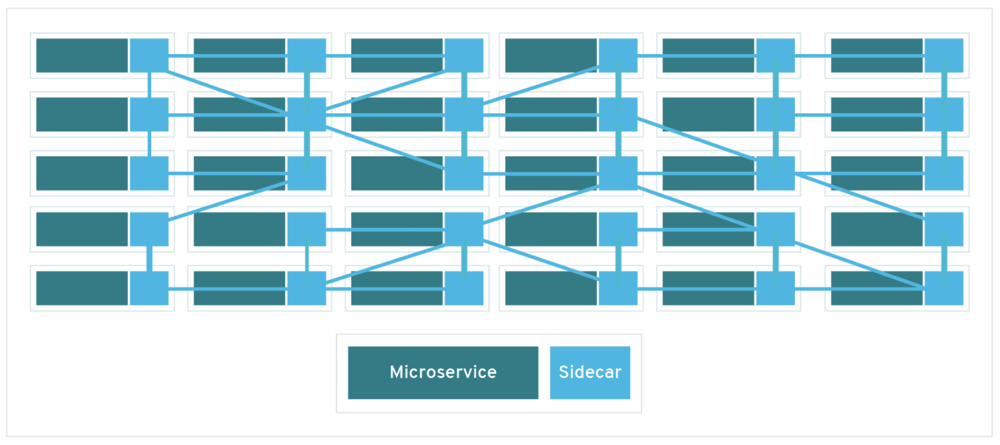
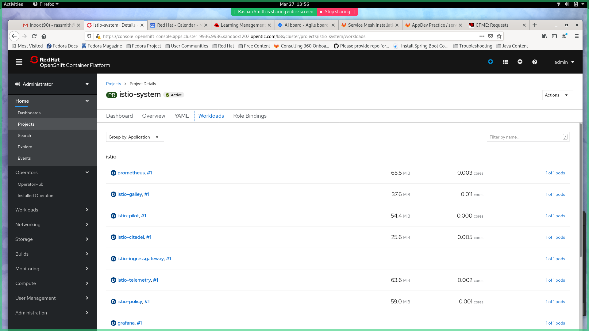
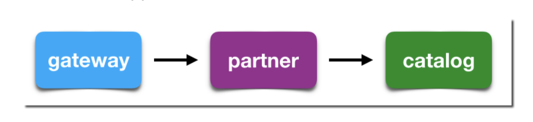
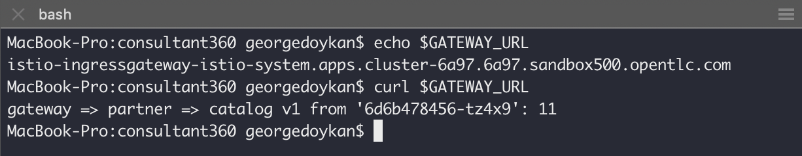
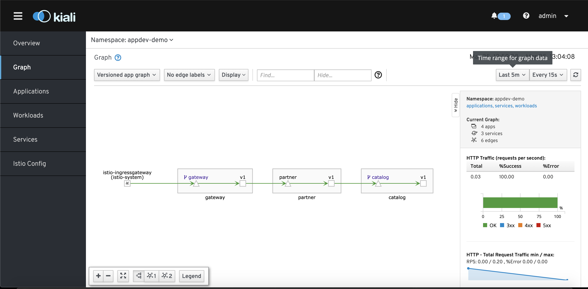

# Service Mesh Overview

### What is Service Mesh?
Service mesh is an added infrastructure layer that enables communication between microservices in a distributed architecture. Red Hat Service Mesh is based on the open source project, Istio which provides more control and configuration of interactions between microservices.

### What are the benefits of using Service Mesh?
Service Mesh provides many utilities that make it easier to manage your microservice architecture abstracting the responsibility of traffic management from the application code. Main capabilities include:
*  Built in security protocols
*  Traffic management
*  Metrics, logging, and tracing
*  Seamless observability

Service mesh is configured by implementing a "sidecar" proxy along each microservice in a service mesh. This sidecar intercepts all traffic to and from a microservice and provides service mesh's utilities.


<div align="center"><h4>The sidecar proxies of each microservice together form the service mesh network</h4></div>


# Technical Pre-requisites
* Install Openshift CLI [here](https://docs.openshift.com/container-platform/4.2/cli_reference/openshift_cli/getting-started-cli.html)  (at least v4)
* Access to an OCP Cluster v4.X with cluster-admin role: [Order an OpenTLC cluster](https://labs.opentlc.com/catalog/explorer)
* Alternatively, Code Ready Containers can be used in lieu of an OCP cluster

# Helpful Pre-requisite Knowledge
* [Openshift Basics](https://www.openshift.com/try?extIdCarryOver=true&sc_cid=701f2000001OH74AAG)
* [Istio documentation](https://istio.io/docs/concepts/what-is-istio/)
* Red Hat Developer [Tutorials](https://developers.redhat.com/topics/service-mesh/)


# Service Mesh Demo 
In this demo, we will install Red Hat Service Mesh and use a sample application consisting of three microservices (Partner, Catalog, and Gateway) to demostrate basic traffic management.

We'll walk through: 
 *  Service mesh Installation
 *  Deploying example application microservices
 *  Configuring service mesh to our example microservices
 *  Demonstrate canary deployments


## Service Mesh Installation
1.  Clone the service mesh installation repo

```
git clone https://gitlab.consulting.redhat.com/appdev-coe/examples/service-mesh/service-mesh-installation.git
```

2. Install Openshift Applier and run Ansible playbooks to install required operators and Istio. <br/>
Required operators: <br/>
`Kiali`: Observability console that allows you to visualize your service mesh <br/>
`Jaeger`: Provides tracing so you can monitor an troubleshoot transactions in a distributed system <br/>
`Elasticsearch`: Serves as the backend for tracing and logging with jaeger <br/>
`Istio`: Service mesh operator 


```
cd service-mesh-installation 
ansible-galaxy install -r requirements.yml -p roles
ansible-playbook site.yml -i inventory/hosts -l bootstrap 
ansible-playbook site.yml -i inventory/hosts -l prereq-operator 
ansible-playbook site.yml -i inventory/hosts -l istio-operator 
ansible-playbook site.yml -i inventory/hosts -l istio-system
```
> **Note:\_** You may need to wait a few minutes between the istio-operator installation and the istio-system installation. If you run into issues try deleting the istio-system namespace and rerunning.


3. Check and make sure all pods are up and running in istio-system and istio-operator before you continue.

```
oc get pods -n istio-system -w
```


<div align="center"><h4>You can also use the web console to check pods</h4></div>

### Mac Users!

> **WARNING:\_** A recent update has placed a limit of the number of forks a process can create. To disable this, set **OBJC_DISABLE_INITIALIZE_FORK_SAFETY=YES**

##### Example

```
OBJC_DISABLE_INITIALIZE_FORK_SAFETY=YES ansible-playbook site.yml -i inventory/hosts -l istio-system
```

This completes the installation of Service Mesh on your Cluster.  The ansible playbooks that you just ran created two namespaces: the `istio-operator` and the `istio-system`.  It then initiated an Operator for Service Mesh in the istio-operator namespace. The operator watches for a `ServiceMeshControlPlane` resource in all namespaces. In the istio-system namespace the playbook installed the ServiceMeshControlPlane resource.  The operator installed previously creates the Service Mesh Control Plane based on the configurations specified in the ServiceMeshControlPlane resource. 

The playbook also deployed a Custom Resource Definition called a `ServiceMeshMemberRoll`.  The Member Roll contains a list of all the namespaces you want onboarded to Service Mesh.  Onboarding a project to Service Mesh via the Service Mesh Member Roll allows Service Mesh to install Sidecar Proxies into pods that are marked with the sidecar proxy injection annotation in your project.  This allows Service Mesh to intercept and manage network traffic to and from the pods.  

## Deploy Microservices: Partner, Catalog, Gateway
In this section we will deploy a simple application with three microservices (Partner, Catalog, and Gateway).  We will use these services as an example to demonstrate basic traffic management via Service Mesh.  The Gateway component of the sample application receives requests and passes them on to the Partner component.  The Partner component then processes the request and makes a request to the catalog for more information.  

Clone the application from the Git Repo posted below and apply the Deployment and Service templates in the repo to get the application going.


<div align="center"><h4>Demo Application Architecture</h4></div>

1. Clone Foundations application repo

```
git clone https://gitlab.consulting.redhat.com/appdev-coe/examples/ocp-foundation-service-mesh.git
```

2. Create a namespace in your Openshift Cluster

```
oc adm new-project appdev-demo
```

3. Deploy Partner
```
cd ocp-foundation-service-mesh
oc apply -f partner/kubernetes/partner-service-template.yml -n appdev-demo
oc apply -f partner/kubernetes/Service.yml -n appdev-demo
```

4. Deploy Catalog

```
oc apply -f catalog/kubernetes/catalog-service-template.yml -n appdev-demo
oc apply -f catalog/kubernetes/Service.yml -n appdev-demo
```

5. Deploy Gateway

```
oc apply -f gateway/kubernetes/gateway-service-template.yml -n appdev-demo
oc apply -f gateway/kubernetes/Service.yml -n appdev-demo
```

6. Check and make sure all pods within appdev-demo are up and running before you continue. Can also use openshift web console.
```
oc get pods -n appdev-demo -w
```

7. Your service pods should each contain two containers.  The first container will correspond to the service it is exposing. The second container should be an istio-proxy container. Please confirm that your pods have the istio-proxy container running by using the following command:  
 
```
oc -n appdev-demo get pod -o jsonpath='{.items[*].spec.containers[*].name}'
```
You should see each service (`catalog`, `gateway`, and `partner`) paired with an `istio-proxy` container.
You now have your demo application deployed with istio sidecar proxies. In the next section we'll work on exposing this application to external users by creating a service mesh ingress gateway service.


## Create Service Mesh Ingress Gateway Service
In order to expose the Gateway component of the sample application to external traffic a Service Mesh Ingress Gateway needs to be configured.  The Service Mesh Ingress Gateway sits on the edge of the Service Mesh and receives and load balances requests routed to the application.  This is done in lieu of directly exposing the application services as a route.  Once configured the Ingress Gateway route can be used to access the application by external users. The Ingress Gateway can be modified to employ request filtering and routing rules. Use the below instructions to deploy a simple Service Mesh Ingress Gateway.

1. Configure Service Mesh Ingress Gateway from the service-mesh-installation repo.
```
cd service-mesh-installation
oc apply -f templates/service-mesh-gateway.yml -n appdev-demo
```
2. Find and Access the application via the Service Mesh Ingress Gateway route

```
GATEWAY_URL=$(oc get route -n istio-system istio-ingressgateway -o jsonpath='{.spec.host}')
curl $GATEWAY_URL
```

<div align="center"><h4>Output from curling the demo application</h4></div>

Now your application is exposed via Service Mesh and accessible through the ingress gateway route. In the next section, we will look at Kiali and how it can visualize your service traffic.

## Visualize Service Mesh with Kiali
Kiali is an observability console for Istio that allows you to further understand your service mesh network. The interface allows you to see the topology of your network, health checks, HTTP requests, and more. Go to the kiali web console by using the kiali service route exposed under istio-system project.

```
oc get route -n istio-system kiali -o jsonpath='{.spec.host}'
```
Here you can manage your service mesh configurations, workloads, and visualize traffic to your services by curling your application route repeatedly.

```
for i in $(seq 50) ; do curl  $GATEWAY_URL; sleep 1 ; done
```

<div align="center"><h4>Kiali Web Console</h4></div>

In the Graph section of Kiali, you can view the topology of your Service Mesh network. You can also see additional traffic metrics such as requests/second, percentage requests, and request response time. You can configure the graph to show different versions of services and to highlight when services are unresponsive. Take a few minutes to explore the Kiali console and play around with the different configurations. For more information on Kiali check out Kiali's [features](https://kiali.io/documentation/features/).

## Canary Deployments
A common use case of service mesh's traffic management capabilities is canary deployments. Similar to A/B testing, this refers to the strategy of introducing a new version of your service by routing a small subset of user traffic to it.

#### Default load balancing (50/50)
By default, kuberenetes will route traffic in a round-robin style to different versions of your service. We'll demonstrate this by deploying a v2 of our catalog service from the service mesh foundations repo.

```
cd ocp-service-mesh-foundations/catalog-v2/kubernetes
oc apply -f catalog-service-template.yml -n appdev-demo
```
Now when you curl your application, you will see traffic is routed 50/50 between v1 and v2. Observe in Kiali.

```
for i in $(seq 50) ; do curl  $GATEWAY_URL; sleep 1 ; done
```

#### Custom Routing (90/10)
By using Istio, we get additional control over our routing. We can specify specific percentages of the traffic we want routed to each version of our service. Custom routing is accomplished by specifying a `VirtualService` and `DestinationRules` for your each of your services. </br>

A `VirtualService` specifies rules that are applied to network requests that are sent through specific hosts. In the VirtualService we will apply, we apply custom routing rules to our catalog service with a weighting of 90% for v1 and 10% for v2. **TODO: add screenshot of yaml to explain how rules are specified**
```
oc project appdev-demo
oc apply -f ./istiofiles/virtual-service-catalog-v1_and_v2.yml
```

`DestinationRules` are policies that are applied to network requests after routing has occurred to a specific service. TLS protocols, circuit breaking, and load balancing are examples of policies that can be configured in DestinationRules. Refer to Istio docs for more detail. **TODO**: explain the destination rules and virtual service we are applying
```
oc apply -f ./istiofiles/destination-rule-catalog-v1-v2.yml
```
Curl the application and observe results in Kiali. You should see ~90% traffic routed to v1 and ~10% routed to v2.

```
for i in $(seq 50) ; do curl  $GATEWAY_URL; sleep 1 ; done
```

#### Further Experimentation
Within the istiofiles folder, there are several `DestinationRules` and `VirtualService` templates that you can apply to change the traffic routing patterns for the sample application. Play around with running these templates and observing changes in Kiali. 


